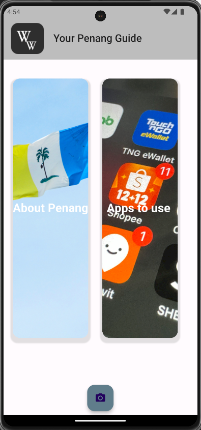

# 🌍 Wander Wise – Smart Penang Tour Guide App




Wander Wise is a Flutter-based mobile application designed to serve as a smart tour guide specifically for Penang, Malaysia. It helps travelers explore nearby attractions, find commonly used local apps, and understand Malay-language signage through integrated camera-based text recognition and translation features.

## 📱 Features of the App

- 🗺️ **Google Maps Integration**  
  View selected destinations on a map with markers and navigate using redirection to Google Maps.

- 📷 **On-Device Text Recognition & Translation**  
  Use the device camera to capture and instantly translate Malay text to English using Google ML Kit.

- 🏛️ **Tourist Information**  
  Discover curated information about places to visit, accommodations, and dining in Penang.

- 📲 **Useful App Recommendations**  
  Access frequently used apps in Malaysia (e.g., Grab, Foodpanda) with redirection to the Play Store.

## 🚀 Getting Started

### Prerequisites
- [Flutter SDK](https://flutter.dev/docs/get-started/install)
- [Android Studio or VS Code](https://flutter.dev/docs/development/tools/overview)
- Android Emulator or physical Android device
- Google Cloud Platform account to obtain Maps & ML Kit API key

### Installation Steps

1. **Clone the Repository**
   ```bash
   git clone https://github.com/your-username/wander-wise.git
   cd wander-wise

**Made with ❤️ by Ashik**
